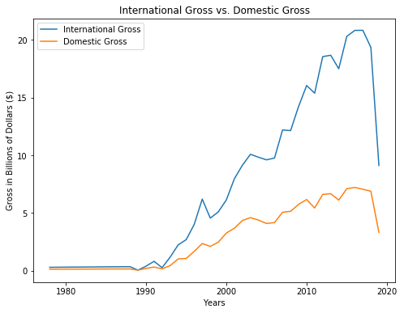
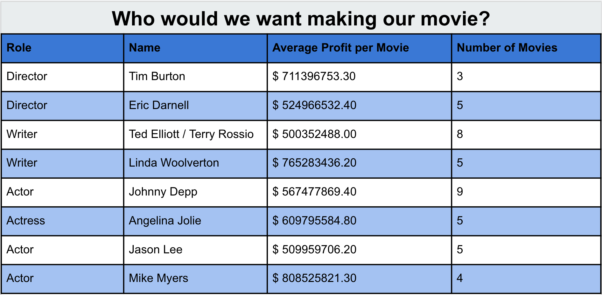

# Movie-Statz : Flatiron Data Science Mod 1 Project
Contributors: Haider Hussain and Brian Yee

In this project we set out to determine what kind of movie would be the most profitable.
## Process
We set up an AWS RDS to store our data from different sources.
Using primarily Python programming language in this project for: 
- Web-scraping and API calls.
- Parsing and cleaning data.
- Executing mySQL queries to access our DB.
- Making visuals using the Matplotlib library.

All notebooks with the source code is located in the notebooks folder.
## Getting our data
We used python's Beautiful Soup library to webscrape from https://www.the-numbers.com/ to get our movie data. We got data from 1978-2019 on 906 movies. For each movie we got:
- the title
- the budget
- the domestic gross
- the international gross
- the runtime
- the MPAA rating
- the release date
- the genre
- the production type
- the creative type

We then made API calls to oMDB for each movie to get a total of 466 associated directors, writers, and actors/actresses.

After getting our data, we uploaded it into our AWS RDS using SQL queries. We used also created a junction table to associate the correct people to their respective movies so that we can determine his/her experience and average profit.
## Our data
We started by defining what it means to be a succesful movie. We compared movies based on their ROI% and weighted our conclusions based on the amount of data backing the results.

### International or Domestic?
First we need to determine which market to cater to: the domestic market or the international market.

###### The drop-off at the end is due to incomplete data for 2019, since it is still 2019 during the making of this graph.

We can see from this graph that the international gross for movies is trending upwards quicker than the domestic gross for movies. Thus we advise to open up the movie to the international market.

### What Genre?

Each graph contains observations for all the movies in that genre. Each movie was plotted on its budget vs. total gross and colored based on its ROI. Plots above the green line (300% ROI) are considered profitable, plots below the red line (0% ROI) have lost money, and plots between the two lines didn't lose money, but is also not very profitable. We chose 300% to be the cut-off for profitability because it gave a good ratio of profitable vs unprofitable for all genres.

This table is a summary of the ROI graph. We determined that adventure movies would be the most likely to profit. Even though it didn't have the highest percentage of profitable movies, it did have the most number of observations to back the results. 

### Who Should Make It?

We first narrowed down our table of people to only include those who have worked on adventure movies to ensure that they are the most experienced. We compared the average profit per movie of these director, writer, and actor/actress and weighed their profits by the number of adventure movies they have worked on. People who have high average profit but have only worked on one movie will be weighed much lower than people with more experience.

## Conclusion
We believe that a movie with the highest chance of succes would be an adventure movie for the international audience directed by Tim Burton or Eric Darnell, written by Ted Elliot and Terry Rossio or Linda Woolverton, and casts Johnny Depp, Angelina Jolie, Jason Lee, and Mike Myers.
